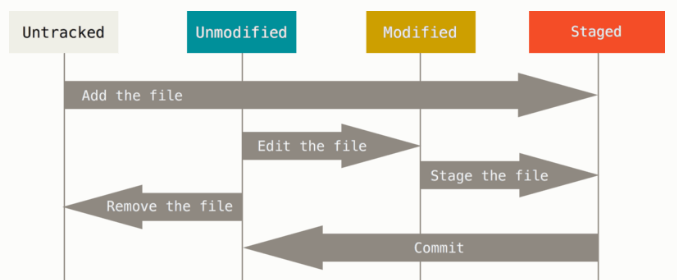

# Github 특강 - Basic

## git 이란?

버전 관리 시스템

github는 git들을 모아놓은 드라이브 개념

CLI(Command Line Interface)

GUI(Graphic User Interface)


## git 설치

1. git-scm.com 에서 다운로드
2. 계속 next로 설치


## git 사용법

### 최초 설정

처음 컴퓨터에 git을 설치하면, 사용자의 이메일과 이름을 적는다.

이는 앞으로 일어나는 커밋에 서명을 하기 위해서 필요하다.

```
$ git config--global user.name "<이름>"

$ git config--global user.email "<이메일>"
```

잘 설정되었나 확인하려면

```
$ git config user.name
이름 출력

$ git config user.email
이메일 출력
```


### 상태 점검

```
$ git status
```



untracked : 처음 등장

staged : commit 준비 단계

unmodified : commit 후 단계

modified : 수정 후 단계


### 초기화

```
$ git init
```

빈 디렉토리(폴더)를 git 저장소(repo)로 초기화

git 폴더 생성

(master) 생김


### add

``` 
$ git add <filename>
$ git add .   # 모두 add
```

untracked 파일 stage로

modified 파일 stage로

=> commit 하기 위함


### commit

```
$ git commit -m 'commit message'
$ git commit --amend   # 바로 전 commit message 변경
```

m : message


### restore

```
$ git restore   # git을 modified로 복구
```


### log

```
$ git log   # commit 히스토리 조회

$ git log --pretty=oneline   # 한 줄로 보기

$ git log --pretty=format:"%h %s" --graph   # 그래프로 보기
```


### 원격 저장소 등록

```
$ git remote add origin <URL>   # 원격 저장소 등록

$ git remote -v   # 원격 저장소 확인
origin <URL>...   # origin remote 저장소의 이름

$ git remote rm <remote_repo_name>   # 저장소 삭제

$ git remote -v   	# 삭제 확인
```


### 원격 저장소에 push

```
$ git push origin master   # remote 이름이 origin 일 경우에 master 브랜치를 push
```


## markdown 사용법

typora 파일->환경설정->이미지->드랍다운 3번(./${filename}.assets 경로로 이미지 복사->체크박스 3번(가능하다면 상대적 위치 사용)

역할 구분은 '#' 개수 혹은 'ctrl+숫자'로 설정 <=개략에서 확인 가능

`(백틱 한번) <=단어 설정

`(백틱 세번) <=박스 설정

ctrl+/ <=보기 변환

| <=표 설정


## Summary

| 명령어                 | 설명                                                         |
| ---------------------- | ------------------------------------------------------------ |
| `$ ls`                 | list 보기                                                    |
| `$ ls -a`              | list 모두 보기                                               |
| `$ mkdir <dir name>`   | make directory 폴더 생성                                     |
| `$ touch <file name>`  | file 생성                                                    |
| `$ cd <dir name>`      | change directory 폴더 이동                                   |
| `$ cd ..`              | directory 위로 이동                                          |
| `$ rm a*`              | a로 시작하는 모든 파일 삭제                                  |
| `$ rm -rf <filename>`  | remove recursively forcefully<br />묻지도 따지지도 않고 삭제 |
| `$ mv <file1> <file2>` | move file1을 file2로 이름 변경                               |
| 명령어 -h              | 명령어 관련 help                                             |
| ctrl+c                 | cancel                                                       |
| ctrl+l                 | 명령문 젤 위로                                               |
| tab키                  | 단어 자동완성                                                |
| : q 혹은 q!            | quit 나가기                                                  |
| Insert키               | 붙여넣기                                                     |

*도움말 http://git-scm.com/book/ko/v2
